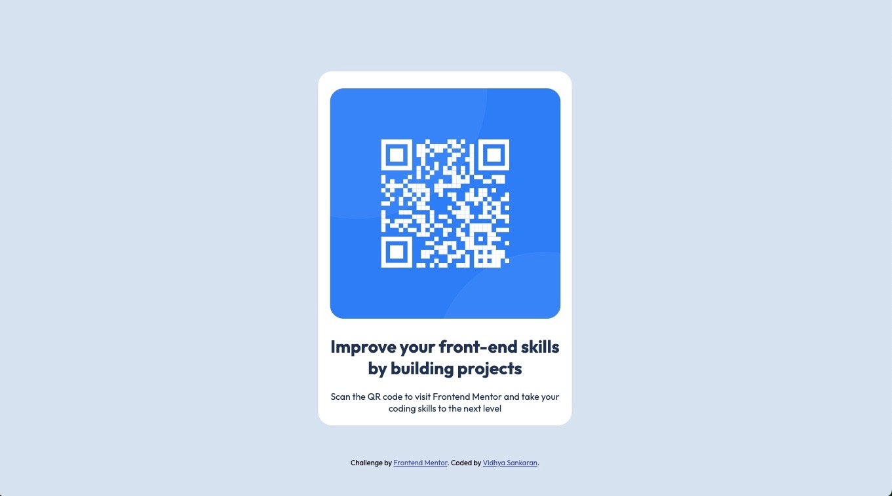

# Frontend Mentor - QR code component solution

This is my solution to the [QR code component challenge on Frontend Mentor](https://www.frontendmentor.io/challenges/qr-code-component-iux_sIO_H). Frontend Mentor challenges help you improve your coding skills by building realistic projects. 

### Screenshot

### Links

- Solution URL: [Add solution URL here](https://your-solution-url.com)
- Live Site URL: [Add live site URL here](https://your-live-site-url.com)

## My process

I used the design and mocked the sections out on paper so it was easy to break it down into code elements.

### Built with

- Semantic HTML5 markup
- CSS custom properties
- Flexbox
- Mobile-first workflow

### What I learned

I learned how to center an item vertically and horizontally using absolute positioning.
I used mobile first design approach and used media queries to make the display larger on bigger screen sizes.

### Continued development

I want to continue exploring more complex design challenges.

## Author

- Website - [Vidhya Sankaran](https://www.your-site.com)
- Frontend Mentor - [@VidsHub](https://www.frontendmentor.io/profile/VidsHub)

## Acknowledgments

I used Google extensively to learn more about positioning elements using css. 

